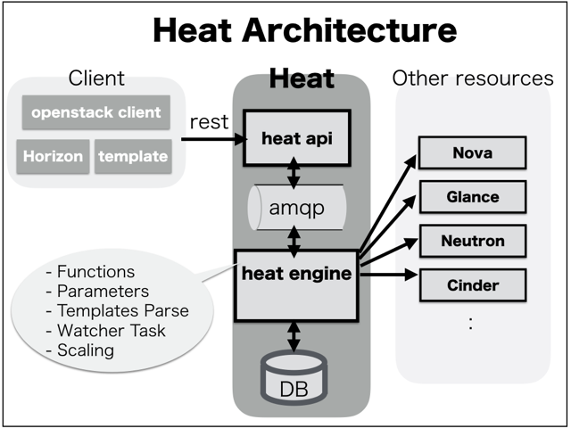

# "OpenStack PolicyEngine疑似体験ツール" とは? ...
OpenStack基盤における権限設定/判定処理として、"oslo.policy"パッケージが活用されています.
https://github.com/openstack/oslo.policy

"policy.json"の挙動をオフラインで確認するツールです. なお、ここでは、OpenStack基盤(Rocky版)での動作を想定しております.

## ◼️ OpenStack基盤(heat)での、処理概要
OpenStack heatは、リクエストに応じて、適切なクラウドオペレーション（novaインスタンス作成など）を行います。

- heat-apiが、ユーザからのリクエストを受け付ける。
- heat-api内部で、必要なコンテキスト処理（token情報の入手等）を実施する。
- heat-api内部で、OpenStack固有の権限設定の記述に従って、実行可否を判定する。
- RabbitMQ等を介して、heat-engine側で適切なオーケストレーション処理を実施する。



## ◼️ heat-api内部での権限判定の流れ
heatスタックを作成する場合だと、[StackControllerクラスのcreateメソッド](https://github.com/openstack/heat/blob/stable/rocky/heat/api/openstack/v1/stacks.py#L398-L418)が起動される.

- [デコレータ"@util.policy_enforce"](https://github.com/openstack/heat/blob/stable/rocky/heat/api/openstack/v1/util.py#L32-L40)が起動される.
- [_policy_enforce"](https://github.com/openstack/heat/blob/stable/rocky/heat/api/openstack/v1/util.py#L43-L57)が起動される.
- [req.context.policy.enforce](https://github.com/openstack/heat/blob/stable/rocky/heat/api/openstack/v1/util.py#L48-L52)が起動される.
- ちなみに、[req.context.policy](https://github.com/openstack/heat/blob/stable/rocky/heat/common/context.py#L117)の実態は、
[policy.get_enforcer()](https://github.com/openstack/heat/blob/stable/rocky/heat/common/context.py#L117)の戻り値、すなわち、[policy.Enforceクラス](https://github.com/openstack/heat/blob/stable/rocky/heat/common/policy.py#L40-L118)である.
- [enforceメソッド](https://github.com/openstack/heat/blob/stable/rocky/heat/common/policy.py#L92-L106)の中身は、こんな感じ.
```python
def enforce(self, context, action, scope=None, target=None,
            is_registered_policy=False):
    """Verifies that the action is valid on the target in this context.

       :param context: Heat request context
       :param action: String representing the action to be checked
       :param target: Dictionary representing the object of the action.
       :raises heat.common.exception.Forbidden: When permission is denied
               (or self.exc if supplied).
       :returns: A non-False value if access is allowed.
    """
    _action = '%s:%s' % (scope or self.scope, action)
    _target = target or {}
    return self._check(context, _action, _target, self.exc, action=action,
                       is_registered_policy=is_registered_policy)
```
- 続いて、[_checkメソッド](https://github.com/openstack/heat/blob/stable/rocky/heat/common/policy.py#L64-L90)が起動されます.
- _checkメソッドの中身は、こんな感じ.
```python
def _check(self, context, rule, target, exc,
           is_registered_policy=False, *args, **kwargs):
    """Verifies that the action is valid on the target in this context.

       :param context: Heat request context
       :param rule: String representing the action to be checked
       :param target: Dictionary representing the object of the action.
       :raises heat.common.exception.Forbidden: When permission is denied
               (or self.exc if supplied).
       :returns: A non-False value if access is allowed.
    """
    do_raise = False if not exc else True
    credentials = context.to_policy_values()
    if is_registered_policy:
        try:
            return self.enforcer.authorize(rule, target, credentials,
                                           do_raise=do_raise,
                                           exc=exc, action=rule)
        except policy.PolicyNotRegistered:
            if self.log_not_registered:
                with excutils.save_and_reraise_exception():
                    LOG.exception(_('Policy not registered.'))
            else:
                raise
    else:
        return self.enforcer.enforce(rule, target, credentials,
                                     do_raise, exc=exc, *args, **kwargs)
```
- "oslo.policy"パッケージで定義された[Enforcerクラスのenforceメソッド](https://github.com/openstack/oslo.policy/blob/stable/rocky/oslo_policy/policy.py#L792-L913)が起動される.
- このあと、"policy.json"の権限設定とコンテキスト情報を比較判定する.
- 判定結果"allowed"が、"True"の場合には、[createメソッド](https://github.com/openstack/heat/blob/stable/rocky/heat/api/openstack/v1/util.py#L48-L55)が起動される.

## ◼️ Policy Engine疑似体験ツールの概要
コンテキスト情報を事前にサンプルとして準備しておいて、Policy Engineを呼び出して、権限判定の結果をオフラインで確認するツールになります.
ちなみに、コンテキスト情報の入手は、OpenStack(Rocky版)の環境を使用して取得しました.


### (1) ツール環境整備
手っ取り早く、動作環境を整えるため、dockerコンテナを活用します.
```
$ docker build -t offline_policy_checker .
$ docker run -it offline_policy_checker bash
```

### (2) 起動してみる
dockerコンテナを起動して、OpenStack権限設定/判定処理を疑似体験してみましょう.

#### (2-1) Heat(Rocky版)での権限設定/判定処理の疑似体験
- まずは、シンプルに疑似体験ツールを起動してみます.

```
root@71073d4e0d8c:~# cd heat_rocky
```
```
root@71073d4e0d8c:~/heat_rocky# python offline_policy_checker.py
------------------------------------------------------------
Checking result: action=[create], allowed=[True]
------------------------------------------------------------
```
- 続いて、事前に準備したコンテキスト情報の内容を確認しつつ、"index"アクション時の権限設定/判定処理を確認します.

```
root@71073d4e0d8c:~/heat_rocky# python offline_policy_checker.py --action index --debug
{
    "username": null, 
    "global_request_id": null, 
    "project_name": null, 
    "user_id": "999e3b9a1f3f4b52ba4c085efb0e6d73", 
    "show_deleted": false, 
    "roles": [
        "_member_", 
        "heat_stack_owner"
    ], 
    "user_identity": "999e3b9a1f3f4b52ba4c085efb0e6d73 f2de30617f9d4ac495035a6cf44ad7b9", 
    "project_domain": "default", 
    "auth_token": "gAAAAABcx5yqci7MnCOKPV3xKPaE4fETwRR8Jy0LOSik9isFlgYBvxr4ZwIdT2SCV1lzXe_b0zg1YCaIHoIbjnd9Blx1Xc8t_muFPjf4B_KX--Uggd7GgankSHU9jLYMS_ctgOi3G3FrfZ5ISfijR-wxt3CSy4Svwj0DMJbzLWlPQRmkapE8b1U", 
    "user_domain": "default", 
    "auth_token_info": {
        "token": {
            "is_domain": false, 
            "methods": [
                "password"
            ], 
            "roles": [
                {
                    "id": "9fe2ff9ee4384b1894a90878d3e92bab", 
                    "name": "_member_"
                }, 
                {
                    "id": "5db01c05664b48e3adad1508d5045695", 
                    "name": "heat_stack_owner"
                }
            ], 
            "auth_token": "gAAAAABcx5yqci7MnCOKPV3xKPaE4fETwRR8Jy0LOSik9isFlgYBvxr4ZwIdT2SCV1lzXe_b0zg1YCaIHoIbjnd9Blx1Xc8t_muFPjf4B_KX--Uggd7GgankSHU9jLYMS_ctgOi3G3FrfZ5ISfijR-wxt3CSy4Svwj0DMJbzLWlPQRmkapE8b1U", 
            "expires_at": "2019-04-30T01:54:02.000000Z", 
            "project": {
                "domain": {
                    "id": "default", 
                    "name": "Default"
                }, 
                "id": "f2de30617f9d4ac495035a6cf44ad7b9", 
                "name": "demo"
            },

... (snip)

        }
    }, 
    "project_id": null, 
    "auth_url": "http://192.168.100.201:5000/v3/", 
    "user": null, 
    "request_id": "req-0c39c326-76b9-48b5-800b-2dc448ad78ed", 
    "is_admin": false, 
    "trustor_user_id": null, 
    "password": null, 
    "aws_creds": null, 
    "trust_id": null, 
    "region_name": null
}
------------------------------------------------------------
Checking result: action=[index], allowed=[True]
------------------------------------------------------------
```

#### (2-2) Nova(Rocky版)でのPolicy権限設定/判定処理の疑似体験

- こちらも、まずは、シンプルに疑似体験ツールを起動してみます.

```
root@71073d4e0d8c:~# cd nova_rocky 
```
```
root@71073d4e0d8c:~/nova_rocky# python offline_policy_checker.py
------------------------------------------------------------
Checking result: action=[reboot], result=[True]
------------------------------------------------------------
```
- 続いて、事前に準備したコンテキスト情報の内容を確認しつつ、"attach_interface"アクション時の権限設定/判定処理を確認します.

```
root@71073d4e0d8c:~/nova_rocky# python offline_policy_checker.py --action attach_interface --debug
{
    "project_name": null, 
    "user_id": null, 
    "quota_class": null, 
    "service_catalog": [], 
    "request_id": "req-244e45fd-521c-4f66-9924-0f5484744526", 
    "is_admin": true, 
    "project_id": null, 
    "user_name": null, 
    "remote_address": null, 
    "read_deleted": "no"
}
------------------------------------------------------------
Checking result: action=[attach_interface], result=[True]
------------------------------------------------------------
```

## ◼️ oslopolicy-checkerを活用した"policy.json"の動作確認
"oslo.policy"では、[oslopolicy-checker](https://docs.openstack.org/oslo.policy/latest/cli/index.html#oslopolicy-checker)コマンドが提供されているようです.
先程、使用したコンテキスト情報を活用して、"oslopolicy-checker"の動作を確認しておきます.

### (1) JSONファイルの事前準備
コンテキスト情報ファイルを、JSON形式に変換しておきます.
"oslopolicy-checker"コマンドが要求するJSON形式は、コンテキスト情報の"auth_token_info"エレメントのみを抽出したものです.
そこで、お手軽に変換ツールで使用して、JSONファイルを準備しておきます.

```
root@71073d4e0d8c:~/heat_rocky# python convert_sample_context.py
{
    "token": {
        "is_domain": false, 
        "methods": [
            "password"
        ], 
        "roles": [
            {
                "id": "9fe2ff9ee4384b1894a90878d3e92bab", 
                "name": "_member_"
            }, 
            {
                "id": "5db01c05664b48e3adad1508d5045695", 
                "name": "heat_stack_owner"
            }
        ], 
        "auth_token": "gAAAAABcx5yqci7MnCOKPV3xKPaE4fETwRR8Jy0LOSik9isFlgYBvxr4ZwIdT2SCV1lzXe_b0zg1YCaIHoIbjnd9Blx1Xc8t_muFPjf4B_KX--Uggd7GgankSHU9jLYMS_ctgOi3G3FrfZ5ISfijR-wxt3CSy4Svwj0DMJbzLWlPQRmkapE8b1U", 
        "expires_at": "2019-04-30T01:54:02.000000Z", 
        "project": {
            "domain": {
                "id": "default", 
                "name": "Default"
            }, 
            "id": "f2de30617f9d4ac495035a6cf44ad7b9", 
            "name": "demo"
        },

... (snip)

        "version": "v3", 
        "user": {
            "domain": {
                "id": "default", 
                "name": "Default"
            }, 
            "id": "999e3b9a1f3f4b52ba4c085efb0e6d73", 
            "name": "demo", 
            "password_expires_at": null
        }, 
        "audit_ids": [
            "wc9FiJOUR0CV09Bej5wZ0w"
        ], 
        "issued_at": "2019-04-30T00:54:02.000000Z"
    }
}
```
"sample_json.txt”ファイルが生成されました.

```
root@71073d4e0d8c:~/heat_rocky# ls -l|grep sample_json.txt
-rw-r--r-- 1 root root 18466 Apr 30 01:33 sample_json.txt
```

### (2) "oslopolicy-checker"コマンドの実行
"oslopolicy-checker"コマンドを起動すると、policy権限許可の判定結果が確認できます.

```
root@71073d4e0d8c:~/heat_rocky# oslopolicy-checker \
> --policy policy.json \
> --access sample_json.txt
passed: cloudwatch:DisableAlarmActions
passed: stacks:list_resource_types
passed: stacks:resource_schema
passed: stacks:update_patch
passed: cloudwatch:ListMetrics
passed: cloudwatch:SetAlarmState
passed: stacks:list_template_functions
passed: stacks:validate_template
passed: software_configs:create
passed: events:show
passed: software_deployments:update
passed: cloudformation:EstimateTemplateCost
passed: software_deployments:metadata
passed: stacks:generate_template
passed: actions:action
passed: stacks:list_snapshots
passed: cloudformation:ListStackResources
passed: cloudwatch:PutMetricAlarm
passed: cloudwatch:DescribeAlarmHistory
passed: software_deployments:delete
passed: stacks:show_snapshot
passed: software_configs:show
passed: stacks:index
passed: cloudformation:CancelUpdateStack
passed: stacks:create
passed: cloudformation:DescribeStacks
passed: stacks:snapshot
passed: resource:mark_unhealthy
passed: stacks:lookup
passed: resource:signal
passed: stacks:preview
passed: cloudwatch:DescribeAlarms
passed: software_deployments:show
passed: cloudwatch:DeleteAlarms
passed: cloudformation:UpdateStack
passed: cloudformation:DeleteStack
passed: cloudwatch:EnableAlarmActions
passed: cloudformation:ListStacks
passed: software_configs:delete
passed: stacks:restore_snapshot
passed: cloudformation:DescribeStackResources
passed: stacks:abandon
passed: events:index
passed: software_deployments:index
passed: cloudformation:DescribeStackResource
failed: software_configs:global_index
passed: stacks:detail
passed: stacks:preview_update_patch
passed: stacks:template
passed: resource:metadata
passed: cloudformation:DescribeStackEvents
passed: cloudformation:GetTemplate
passed: stacks:preview_update
passed: stacks:delete_snapshot
failed: resource_types:OS::Nova::Flavor
failed: stacks:global_index
failed: service:index
passed: stacks:delete
passed: cloudformation:CreateStack
passed: stacks:list_template_versions
passed: resource:show
passed: software_configs:index
passed: stacks:export
passed: cloudformation:ValidateTemplate
passed: stacks:show
passed: resource:index
passed: software_deployments:create
passed: cloudwatch:GetMetricStatistics
passed: stacks:update
passed: cloudwatch:PutMetricData
passed: cloudwatch:DescribeAlarmsForMetric
passed: build_info:build_info
passed: stacks:show_output
passed: stacks:list_outputs
```
